**Дисклеймер**
Цель данного бота - разнообразить будни физтеха. Провести время интересно
и с пользой.
Данный бот имеет следующий функционал:

**0) Непредусмотренная команда от пользователя (включая несуществующие
варианты ответа).**

Ой, я вас не понимаю! Попробуйте снова или напишите \\menu чтобы
вернуться а главное меню.

**1) Приветсвие**

Здравствуйте! Я --- чат-бот Time_To_Play_bot! Пожалуйста, представьтесь:

**2) Главное меню**

Доброго времени суток, ...! Чем я могу вам помочь? Выберете категорию:

\\menu --- Вернуться в меню.

\\score --- Посмотреть ваши баллы.

\\rating --- Посмотреть текущую таблицу лидеров.

\\riddles --- Игра «Математические задачи»

\\rebus --- Игра «Ребусы»

\\flags --- Игра «Отгадай страну по флагу»

**3) Текущие баллы**

*if 0 \<= score \< 30*

\\menu --- Вернуться в меню.

На текущий момент у вас ... баллов! Не расстраивайтесь! Вы можете
получить баллы играя в следующие игры:

\\riddles --- Игра «Математические загадки»

\\rebus --- Игра «Историческая викторина»

\\flags --- Игра «Отгадай страну по флагу»

*if 30 \<= score \< 60*

\\menu --- Вернуться в меню.

На текущий момент у вас ... баллов! Так держать! Вы можете получить
баллы играя в следующие игры:

\\riddles --- Игра «Математические загадки»

\\rebus --- Игра «Историческая викторина»

\\flags --- Игра «Отгадай страну по флагу»

*if 60 \<= score \< 90*

\\menu --- Вернуться в меню.

На текущий момент у вас ... баллов! Вы потрясающий! Вы можете получить
баллы играя в следующие игры:

\\riddles --- Игра «Математические загадки»

\\rebus --- Игра «Историческая викторина»

\\flags --- Игра «Отгадай страну по флагу»

*if 90 \<= score*

\\menu --- Вернуться в меню.

На текущий момент у вас ... баллов! Не каждый так сможет! ..., вы
Великолепны! Вы можете получить баллы играя в следующие игры:

\\riddles --- Игра «Математические загадки»

\\rebus --- Игра «Историческая викторина»

\\flags --- Игра «Отгадай страну по флагу»

**4) Таблица рейтинга**

Текущая таблица лидеров:

1\. Алладин \-\-\-\-\-\-\-\-\-\-\-\-\-\-\-\-\-\-\-\-- 120

2\. Кулапин Артур \-\-\-\-\-\-\-\-\-\-\-\-- 106

3\. Тюленев Александр \-\-\-\-\-\-\--100

4\. Андреев Кирилл \-\-\-\-\-\-\-\-\-\-\-- 70

5\. Программист \-\-\-\-\-\-\-\-\-\-\-\-\-\-\-- 54

6\. Incognito \-\-\-\-\-\-\-\-\-\-\-\-\-\-\-\-\-\-\-\-\-\--10

На данный момент вы ... .Продолжайте играть и получать баллы!

\\menu --- Вернуться в меню.

\\riddles --- Игра «Математические загадки»

\\rebus --- Игра «Историческая викторина»

\\flags --- Игра «Отгадай страну по флагу»

**5) Игра «Математические задачи».**

Default 10 60

У вас ещё ... нерешённых задач. Вы можете получить ещё \... баллов.

Нажмите \\start чтобы начать играть.

Нажмите \\menu чтобы вернуться в главное меню.

***5.1 Вопроc 1***

За эту задачу вы можете получить 3 балла!

Сколько элементов в группе перестановок S~₅~? Выберете один из следующих
вариантов ответов (напишите только номер ответа):

1\. 5

2\. 120

3\. 25

4\. 2

5\. 10

<ins>Right answer 2. 120.</ins>

*Если пользователь ответил верно:*

Да, это правильный ответ! Вы получили 3 балла! У вас ещё 9 нерешённых
задач и вы можете получить ещё 57 баллов

Нажмите \\continue чтобы перейти к следующей задаче.

Нажмите \\menu чтобы вернуться в главное меню.

*Если пользователь ответил НЕ верно:*

Нет, это неправильный ответ. =( Не расстраивайтесь, вы можете
попробовать снова.

Нажмите \\retry чтобы попробовать снова.

Нажмите \\menu чтобы вернуться в главное меню.

***5.2 Вопроc 2***

За эту задачу вы можете получить 5 баллов!

Какая матрица называется верхней треугольной? Выберете один из следующих
вариантов ответов (напишите только номер ответа):

1\. Матрица, у которой все недиагональные элементы равны 0

2\. Матрица, у которой все элементы выше главной диагонали равны 0.

3\. Матрица, у которой все элементы ниже главной диагонали равны 0.

4\. Матрица, у которой все элементы выше главной диагонали равны 1.

5\. Матрица, у которой все элементы ниже главной диагонали равны 1.

<ins>Right answer 3. Матрица, у которой все элементы ниже главной диагонали
равны 0.</ins>

*Если пользователь ответил верно:*

Да, это правильный ответ! Вы получили 5 баллов! У вас ещё 8 нерешённых
задач и вы можете получить ещё 52 балла

Нажмите \\continue чтобы перейти к следующей задаче.

Нажмите \\menu чтобы вернуться в главное меню.

*Если пользователь ответил НЕ верно:*

Нет, это неправильный ответ. =( Не расстраивайтесь, вы можете
попробовать снова.

Нажмите \\retry чтобы попробовать снова.

Нажмите \\menu чтобы вернуться в главное меню.

***5.3 Вопрос 3***

За эту задачу вы можете получить 7 баллов!

Вставьте пропущенное слово.

Теорема ... гласит, что из любой ограниченной последовательности можно
выделить сходящуюся подпоследовательность.

<ins>Right answer Больцано-Вейерштрасса</ins>

*Если пользователь ответил верно:*

Да, это правильный ответ! Вы получили 7 баллов! У вас ещё 7 нерешённых
задач и вы можете получить ещё 45 балла.

Нажмите \\continue чтобы перейти к следующей задаче.

Нажмите \\menu чтобы вернуться в главное меню.

*Если пользователь ответил НЕ верно:*

Нет, это неправильный ответ. =( Не расстраивайтесь, вы можете
попробовать снова.

Нажмите \\retry чтобы попробовать снова.

Нажмите \\menu чтобы вернуться в главное меню.

***5.4 Вопрос 4***

За эту задачу вы можете получить 10 баллов!

Вставьте пропущенные слова.

В математическом анализе важную роль играют теоремы о среднем. Это
теоремы ... , ... и ... .

<ins>Right answer Ролля Лагранжа Коши (без учёта регистра. Учитываются все
перестановки. Допустимо до 2х опечаток в фамилиях)</ins>

*Если пользователь ответил верно:*

Да, это правильный ответ! Вы получили 10 баллов! У вас ещё 6 нерешённых
задач и вы можете получить ещё 35 баллов.

Нажмите \\continue чтобы перейти к следующей задаче.

Нажмите \\menu чтобы вернуться в главное меню.

*Если пользователь ответил НЕ верно:*

Нет, это неправильный ответ. =( Не расстраивайтесь, вы можете
попробовать снова.

Нажмите \\retry чтобы попробовать снова.

Нажмите \\menu чтобы вернуться в главное меню.

***5.5 Вопрос 5***

За эту задачу вы можете получить 3 балла!

Чему равен определитель матрицы

\| 3 5 -4\|\
\|10 -8 2\|\
\| 6 10 -8\|

Выберете один из следующих вариантов ответов (напишите только номер
ответа):

1\. 0

2\. -16

3\. 21

4\. 37

5\. -42

<ins>Right answer 1. 0</ins>

*Если пользователь ответил верно:*

Да, это правильный ответ! Вы получили 10 баллов! У вас ещё 5 нерешённых
задач и вы можете получить ещё 32 баллов.

Нажмите \\continue чтобы перейти к следующей задаче.

Нажмите \\menu чтобы вернуться в главное меню.

*Если пользователь ответил НЕ верно:*

Нет, это неправильный ответ. =( Не расстраивайтесь, вы можете
попробовать снова.

Нажмите \\retry чтобы попробовать снова.

Нажмите \\menu чтобы вернуться в главное меню.

***5.6 Вопрос 6***

За эту задачу вы можете получить 5 баллов!

Известно, что лектор по алгоритмам студентов ВШПИ приготовил ученикам 3
контеста и 2 теоретических задания. Каждую неделю он собирается
выкладывать по 1 заданию (либо контест, либо теоретическое). Сколькими
способами он может это сделать?

Выберете один из следующих вариантов ответов (напишите только номер
ответа):

1\. 5

2\. 3

3\. 120

4\. 20

5\. 10

<ins>Right answer 5. 10</ins>

*Если пользователь ответил верно:*

Да, это правильный ответ! Вы получили 5 баллов! У вас ещё 4 нерешённые
задачи и вы можете получить ещё 27 баллов.

Нажмите \\continue чтобы перейти к следующей задаче.

Нажмите \\menu чтобы вернуться в главное меню.

*Если пользователь ответил НЕ верно:*

Нет, это неправильный ответ. =( Не расстраивайтесь, вы можете
попробовать снова.

Нажмите \\retry чтобы попробовать снова.

Нажмите \\menu чтобы вернуться в главное меню.

***5.7 Вопрос 7***

За эту задачу вы можете получить 10 баллов!

Сколько существует типов линий второго порядка? Поверхностей второго
порядка.

Выберете один из следующих вариантов ответов (напишите только номер
ответа):

1\. 9, 17

2\. 7, 17

3\. 9, 19

4\. 7, 19

5\. 3, 9

<ins>Right answer 1. 9, 17</ins>

*Если пользователь ответил верно:*

Да, это правильный ответ! Вы получили 10 баллов! У вас ещё 3 нерешённые
задачи и вы можете получить ещё 17 баллов.

Нажмите \\continue чтобы перейти к следующей задаче.

Нажмите \\menu чтобы вернуться в главное меню.

*Если пользователь ответил НЕ верно:*

Нет, это неправильный ответ. =( Не расстраивайтесь, вы можете
попробовать снова.

Нажмите \\retry чтобы попробовать снова.

Нажмите \\menu чтобы вернуться в главное меню.

***5.8 Вопрос 8***

За эту задачу вы можете получить 10 баллов!

Вставьте пропущенные слова.

Предел отношения синуса какого-либо аргумента к этому аргументу при
стремлении аргумента к нулю равен единице, и называется ... .

<ins>Right answer первым замечательным пределом (первый замечательный
предел)</ins>

*Если пользователь ответил верно:*

Да, это правильный ответ! Вы получили 10 баллов! У вас ещё 2 нерешённые
задачи и вы можете получить ещё 7 баллов.

Нажмите \\continue чтобы перейти к следующей задаче.

Нажмите \\menu чтобы вернуться в главное меню.

*Если пользователь ответил НЕ верно:*

Нет, это неправильный ответ. =( Не расстраивайтесь, вы можете
попробовать снова.

Нажмите \\retry чтобы попробовать снова.

Нажмите \\menu чтобы вернуться в главное меню.

***5.9 Вопрос 9***

За эту задачу вы можете получить 3 балла!

Владу нужно поселить 7 первокурсников в общежитие. В данный момент в
общежитии свободно 3 комнаты: одноместная, двухместная и четырёхместная.

Помогите Владу и посчитайте, сколькими способами можно поселить
первокурсников?

1\. 7

2\. 5040

3\. 105

4\. 48

5\. 21

</ins>Right answer 3. 105<ins>

*Если пользователь ответил верно:*

Да, это правильный ответ! Вы получили 3 балла! У вас ещё 1 нерешённая
задача и вы можете получить ещё 4 балла.

Нажмите \\continue чтобы перейти к следующей задаче.

Нажмите \\menu чтобы вернуться в главное меню.

*Если пользователь ответил НЕ верно:*

Нет, это неправильный ответ. =( Не расстраивайтесь, вы можете
попробовать снова.

Нажмите \\retry чтобы попробовать снова.

Нажмите \\menu чтобы вернуться в главное меню.

***5.10 Вопрос 10***

За эту задачу вы можете получить 4 балла!

Какой коэффициент при x³ в (x² + x + 1)⁵?

1\. 20

2\. 30

3\. 10

4\. 15

5\. 120

<ins>Right answer 2. 30</ins>

*Если пользователь ответил верно:*

Да, это правильный ответ! Вы получили 4 балла! Вы решили все задачи из
этого раздела! Поздравляем!

Нажмите \\menu чтобы вернуться в главное меню.

*Если пользователь ответил НЕ верно:*

Нет, это неправильный ответ. =( Не расстраивайтесь, вы можете
попробовать снова.

Нажмите \\retry чтобы попробовать снова.

Нажмите \\menu чтобы вернуться в главное меню.

**6) Игра «Ребусы»**

Default 10

У вас ещё ... нерешённых ребусов. За каждый решённый ребус вы получаете
4 балла.

Нажмите \\start чтобы начать играть.

Нажмите \\menu чтобы вернуться в главное меню.

**6.1 Ребус 1**

Ребус №1. Напишите ответ.

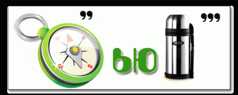

<ins>Right answer Компьютер</ins>

*Если пользователь ответил верно:*

Да, это правильный ответ! Вы получили 4 балла!

Нажмите \\continue чтобы перейти к следующему ребусу.

Нажмите \\menu чтобы вернуться в главное меню.

*Если пользователь ответил НЕ верно:*

Нет, это неправильный ответ. =( Не расстраивайтесь, вы можете
попробовать снова.

Нажмите \\retry чтобы попробовать снова.

Нажмите \\menu чтобы вернуться в главное меню.

**6.2 Ребус 2**

Ребус №2. Напишите ответ.

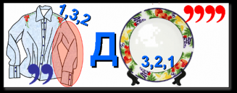

<ins>Right answer Квадрат</ins>

*Если пользователь ответил верно:*

Да, это правильный ответ! Вы получили 4 балла!

Нажмите \\continue чтобы перейти к следующему ребусу.

Нажмите \\menu чтобы вернуться в главное меню.

*Если пользователь ответил НЕ верно:*

Нет, это неправильный ответ. =( Не расстраивайтесь, вы можете
попробовать снова.

Нажмите \\retry чтобы попробовать снова.

Нажмите \\menu чтобы вернуться в главное меню.

**6.3 Ребус 3**

Ребус №3. Напишите ответ.

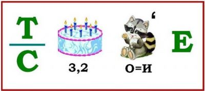

<ins>Right answer Настроение</ins>

*Если пользователь ответил верно:*

Да, это правильный ответ! Вы получили 4 балла!

Нажмите \\continue чтобы перейти к следующему ребусу.

Нажмите \\menu чтобы вернуться в главное меню.

*Если пользователь ответил НЕ верно:*

Нет, это неправильный ответ. =( Не расстраивайтесь, вы можете
попробовать снова.

Нажмите \\retry чтобы попробовать снова.

Нажмите \\menu чтобы вернуться в главное меню.

**6.4 Ребус 4**

Ребус №4. Напишите ответ.

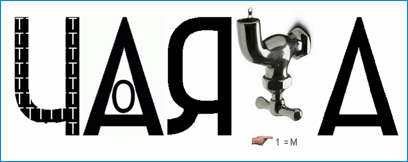

<ins>Right answer Почтовая марка</ins>

*Если пользователь ответил верно:*

Да, это правильный ответ! Вы получили 4 балла!

Нажмите \\continue чтобы перейти к следующему ребусу.

Нажмите \\menu чтобы вернуться в главное меню.

*Если пользователь ответил НЕ верно:*

Нет, это неправильный ответ. =( Не расстраивайтесь, вы можете
попробовать снова.

Нажмите \\help чтобы получить подсказку.

Нажмите \\retry чтобы попробовать снова.

Нажмите \\menu чтобы вернуться в главное меню.

*Подсказка*

Ответ из двух слов. Бумажная путешественница

**6.5 Ребус 5**

Ребус №5. Напишите ответ.

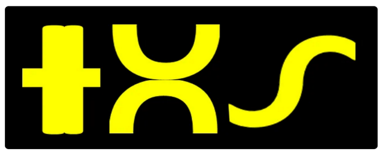

<ins>Right answer Нос</ins>

*Если пользователь ответил верно:*

Да, это правильный ответ! Вы получили 4 балла!

Нажмите \\continue чтобы перейти к следующему ребусу.

Нажмите \\menu чтобы вернуться в главное меню.

*Если пользователь ответил НЕ верно:*

Нет, это неправильный ответ. =( Не расстраивайтесь, вы можете
попробовать снова.

Нажмите \\help чтобы получить подсказку.

Нажмите \\retry чтобы попробовать снова.

Нажмите \\menu чтобы вернуться в главное меню.

*Подсказка*

Слово из трёх букв

**6.6 Ребус 6**

Ребус №6. Напишите ответ.

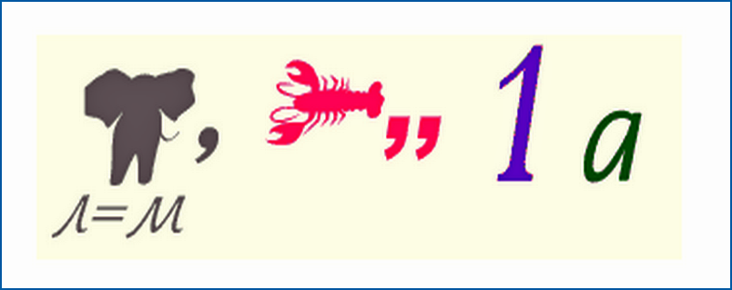

<ins>Right answer Смородина</ins>

*Если пользователь ответил верно:*

Да, это правильный ответ! Вы получили 4 балла!

Нажмите \\continue чтобы перейти к следующему ребусу.

Нажмите \\menu чтобы вернуться в главное меню.

*Если пользователь ответил НЕ верно:*

Нет, это неправильный ответ. =( Не расстраивайтесь, вы можете
попробовать снова.

Нажмите \\retry чтобы попробовать снова.

Нажмите \\menu чтобы вернуться в главное меню.

**6.7 Ребус 7**

Ребус №7. Напишите ответ.

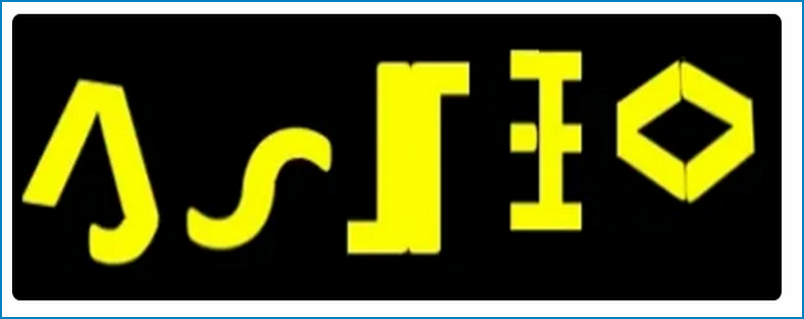

<ins>Right answer Успех</ins>

*Если пользователь ответил верно:*

Да, это правильный ответ! Вы получили 4 балла!

Нажмите \\continue чтобы перейти к следующему ребусу.

Нажмите \\menu чтобы вернуться в главное меню.

*Если пользователь ответил НЕ верно:*

Нет, это неправильный ответ. =( Не расстраивайтесь, вы можете
попробовать снова.

Нажмите \\retry чтобы попробовать снова.

Нажмите \\menu чтобы вернуться в главное меню.

**6.8 Ребус 8**

Ребус №8. Напишите ответ

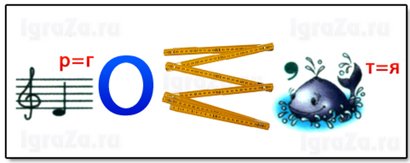

<ins>Right answer Геометрия</ins>

*Если пользователь ответил верно:*

Да, это правильный ответ! Вы получили 4 балла!

Нажмите \\continue чтобы перейти к следующему ребусу.

Нажмите \\menu чтобы вернуться в главное меню.

*Если пользователь ответил НЕ верно:*

Нет, это неправильный ответ. =( Не расстраивайтесь, вы можете
попробовать снова.

Нажмите \\retry чтобы попробовать снова.

Нажмите \\menu чтобы вернуться в главное меню.

**6.9 Ребус 9**

Ребус №9. Напишите ответ

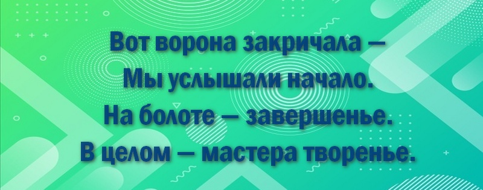

<ins>Right answer Картина</ins>

*Если пользователь ответил верно:*

Да, это правильный ответ! Вы получили 4 балла!

Нажмите \\continue чтобы перейти к следующему ребусу.

Нажмите \\menu чтобы вернуться в главное меню.

*Если пользователь ответил НЕ верно:*

Нет, это неправильный ответ. =( Не расстраивайтесь, вы можете
попробовать снова.

Нажмите \\retry чтобы попробовать снова.

Нажмите \\menu чтобы вернуться в главное меню.

**6.10 Ребус 10**

Ребус №10. Напишите ответ.

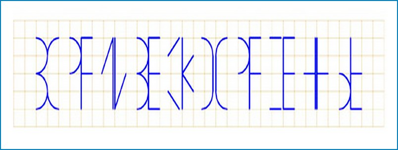

<ins>Right answer Зри в корень</ins>

*Если пользователь ответил верно:*

Да, это правильный ответ! Вы получили 4 балла!

Нажмите \\menu чтобы вернуться в главное меню.

*Если пользователь ответил НЕ верно:*

Нет, это неправильный ответ. =( Не расстраивайтесь, вы можете
попробовать снова.

Нажмите \\help чтобы получить подсказку

Нажмите \\retry чтобы попробовать снова.

Нажмите \\menu чтобы вернуться в главное меню.

*Подсказка*

Попробуйте поменять местами половинки.

**7) Игра «Отгадай страну по флагу»**

Default 10

У вас ещё ... неразгаданных стран. За каждую отгаданную страну вы
получаете 4 балла.

Нажмите \\start чтобы начать играть.

Нажмите \\menu чтобы вернуться в главное меню.

**7.1 Флаг 1**

Флаг №1. Флаг какой страны изображён на картинке?

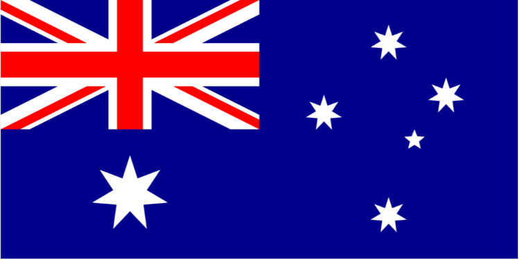

1\. Новая Зеландия

2\. Индия

3\. Австралия

4\. США

<ins>Right answer 1. Австралия</ins>

*Если пользователь ответил верно:*

Да, это правильный ответ! Вы получили 4 балла!

Нажмите \\continue чтобы перейти к следующему флагу.

Нажмите \\menu чтобы вернуться в главное меню.

*Если пользователь ответил НЕ верно:*

Нет, это неправильный ответ. =( Не расстраивайтесь, вы можете
попробовать снова.

Нажмите \\retry чтобы попробовать снова.

Нажмите \\menu чтобы вернуться в главное меню.

**7.2 Флаг 2**

Флаг №2. Флаг какой страны изображён на картинке?

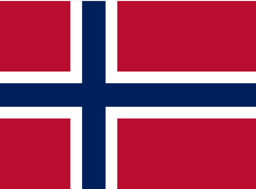

1\. Норвегия

2\. Швеция

3\. Танзания

4\. Швейцария

<ins>Right answer 1. Норвегия</ins>

*Если пользователь ответил верно:*

Да, это правильный ответ! Вы получили 4 балла!

Нажмите \\continue чтобы перейти к следующему флагу.

Нажмите \\menu чтобы вернуться в главное меню.

*Если пользователь ответил НЕ верно:*

Нет, это неправильный ответ. =( Не расстраивайтесь, вы можете
попробовать снова.

Нажмите \\retry чтобы попробовать снова.

Нажмите \\menu чтобы вернуться в главное меню.

**7.3 Флаг 3**

Флаг №3. Флаг какой страны изображён на картинке?

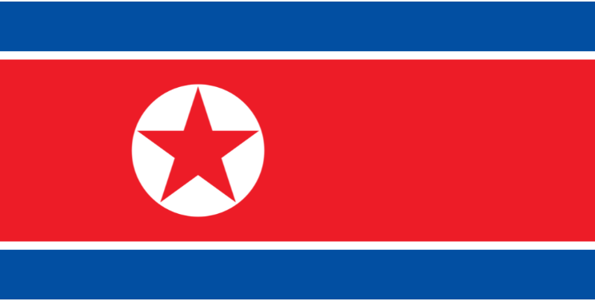

1\. Доминиканская Республика

2\. Демократическая Республика Конго

3\. Китайская народная республика

4\. Корейская Народно-Демократическая республика

<ins>Right answer 4. Корейская Народно-Демократическая
республика</ins>

*Если пользователь ответил верно:*

Да, это правильный ответ! Вы получили 4 балла!

Нажмите \\continue чтобы перейти к следующему флагу.

Нажмите \\menu чтобы вернуться в главное меню.

*Если пользователь ответил НЕ верно:*

Нет, это неправильный ответ. =( Не расстраивайтесь, вы можете
попробовать снова.

Нажмите \\retry чтобы попробовать снова.

Нажмите \\menu чтобы вернуться в главное меню.

**7.4 Флаг 4**

Флаг №4. Флаг какой страны изображён на картинке?

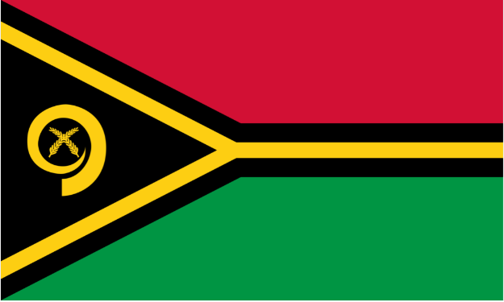

1\. Джибути

2\. Чехия

3\. Вануату

4\. Центральноафриканская республика

<ins>Right answer 3. Вануату</ins>

*Если пользователь ответил верно:*

Да, это правильный ответ! Вы получили 4 балла!

Нажмите \\continue чтобы перейти к следующему флагу.

Нажмите \\menu чтобы вернуться в главное меню.

*Если пользователь ответил НЕ верно:*

Нет, это неправильный ответ. =( Не расстраивайтесь, вы можете
попробовать снова.

Нажмите \\retry чтобы попробовать снова.

Нажмите \\menu чтобы вернуться в главное меню.

**7.5 Флаг 5**

Флаг №5. Флаг какой страны изображён на картинке?

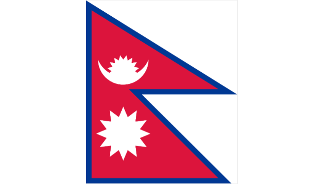

1\. Чили

2\. Вьетнам

3\. Бангладеш

4\. Непал

<ins>Right answer 4. Непал</ins>

*Если пользователь ответил верно:*

Да, это правильный ответ! Вы получили 4 балла!

Нажмите \\continue чтобы перейти к следующему флагу.

Нажмите \\menu чтобы вернуться в главное меню.

*Если пользователь ответил НЕ верно:*

Нет, это неправильный ответ. =( Не расстраивайтесь, вы можете
попробовать снова.

Нажмите \\retry чтобы попробовать снова.

Нажмите \\menu чтобы вернуться в главное меню.

**7.6 Флаг 6**

Флаг №6. Флаг какой страны изображён на картинке?

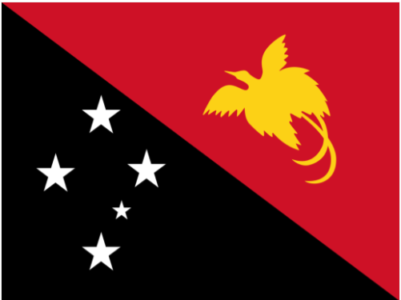

1\. Новая Зеландия

2\. Индия

3\. Папуа - Новая Гвинея

4\. Сомали

<ins>Right answer 3. Папуа - Новая Гвинея</ins>

*Если пользователь ответил верно:*

Да, это правильный ответ! Вы получили 4 балла!

Нажмите \\continue чтобы перейти к следующему флагу.

Нажмите \\menu чтобы вернуться в главное меню.

*Если пользователь ответил НЕ верно:*

Нет, это неправильный ответ. =( Не расстраивайтесь, вы можете
попробовать снова.

Нажмите \\retry чтобы попробовать снова.

Нажмите \\menu чтобы вернуться в главное меню.

**7.7 Флаг 7**

Флаг №7. Флаг какой страны изображён на картинке?

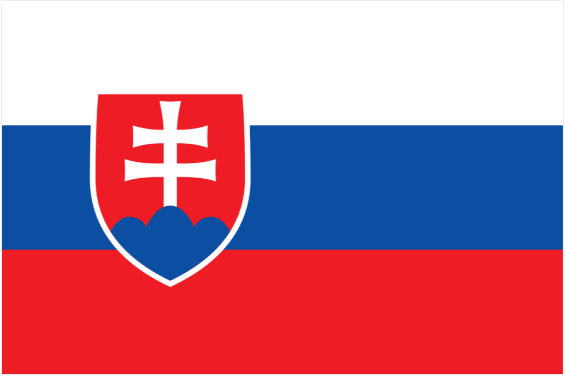

1\. Черногория

2\. Чехия

3\. Сербия

4\. Словакия

<ins>Right answer 4. Словакия</ins>

*Если пользователь ответил верно:*

Да, это правильный ответ! Вы получили 4 балла!

Нажмите \\continue чтобы перейти к следующему флагу.

Нажмите \\menu чтобы вернуться в главное меню.

*Если пользователь ответил НЕ верно:*

Нет, это неправильный ответ. =( Не расстраивайтесь, вы можете
попробовать снова.

Нажмите \\retry чтобы попробовать снова.

Нажмите \\menu чтобы вернуться в главное меню.

**7.8 Флаг 8**

Флаг №8. Флаг какой страны изображён на картинке?

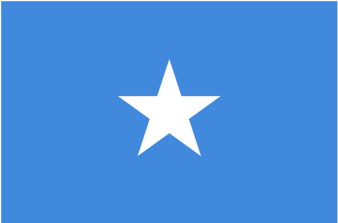

1\. Джибути

2\. Сомали

3\. Албания

4\. Чад

<ins>Right answer 2. Сомали</ins>

*Если пользователь ответил верно:*

Да, это правильный ответ! Вы получили 4 балла!

Нажмите \\continue чтобы перейти к следующему флагу.

Нажмите \\menu чтобы вернуться в главное меню.

*Если пользователь ответил НЕ верно:*

Нет, это неправильный ответ. =( Не расстраивайтесь, вы можете
попробовать снова.

Нажмите \\retry чтобы попробовать снова.

Нажмите \\menu чтобы вернуться в главное меню.

**7.9 Флаг 9**

Флаг №9. Флаг какой страны изображён на картинке?

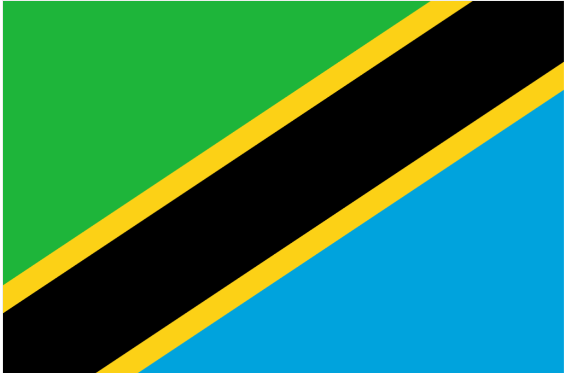

1\. Чад

2\. Боливия

3\. Танзания

4\. Центральноафриканская республика

<ins>Right answer 3. Танзания</ins>

*Если пользователь ответил верно:*

Да, это правильный ответ! Вы получили 4 балла!

Нажмите \\continue чтобы перейти к следующему флагу.

Нажмите \\menu чтобы вернуться в главное меню.

*Если пользователь ответил НЕ верно:*

Нет, это неправильный ответ. =( Не расстраивайтесь, вы можете
попробовать снова.

Нажмите \\retry чтобы попробовать снова.

Нажмите \\menu чтобы вернуться в главное меню.

**7.10 Флаг 10**

Флаг №10. Флаг какой страны изображён на картинке?

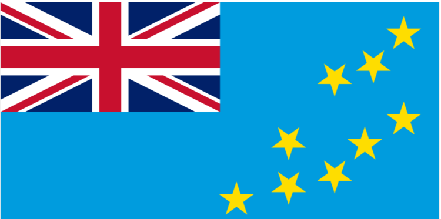

1\. Зимбабве

2\. Тувалу

3\. Индонезия

4\. Сингапур

<ins>Right answer 2. Тувалу</ins>

*Если пользователь ответил верно:*

Да, это правильный ответ! Вы получили 4 балла! Вы решили все задачи из
этого раздела! Поздравляем!

Нажмите \\menu чтобы вернуться в главное меню.

*Если пользователь ответил НЕ верно:*

Нет, это неправильный ответ. =( Не расстраивайтесь, вы можете
попробовать снова.

Нажмите \\retry чтобы попробовать снова.

Нажмите \\menu чтобы вернуться в главное меню.
